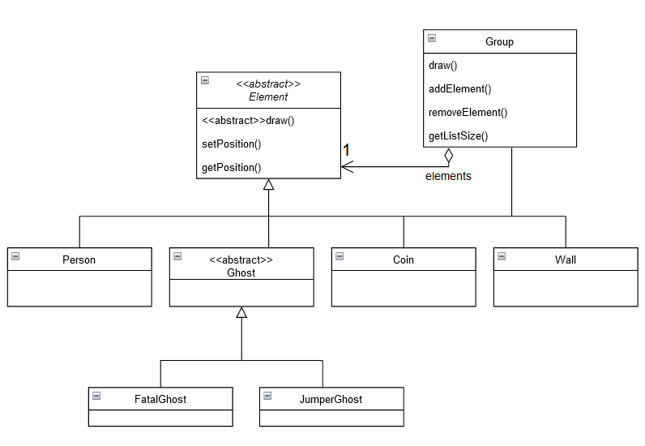
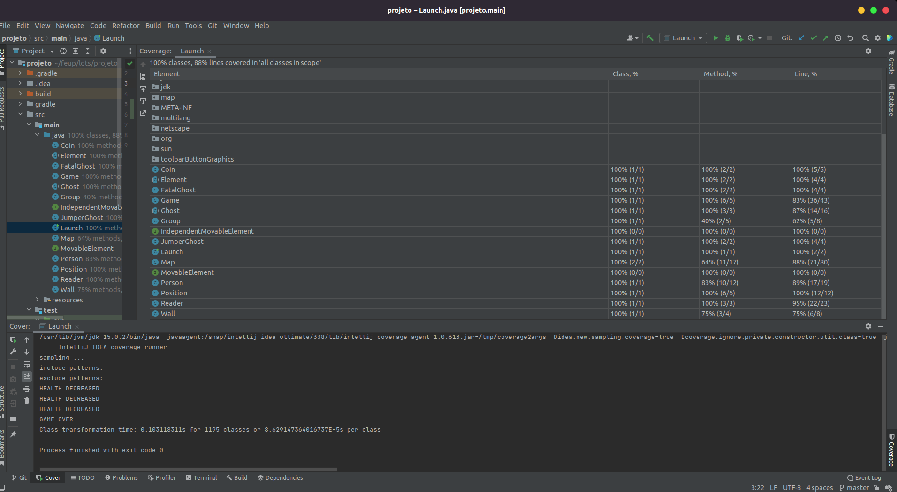

## LDTS - Coin Collector

> O jogo consiste numa pessoa que tem como objetivo colectar todas as moedas presentes no mapa para alcançar a vitória. Como obstáculos terá 2 tipos de fantasmas e vai ter que enfrentar um labirinto que dificulta a conquista do seu objetivo.
>
> Este projeto foi desenvolvido por Diogo Fonte(up202004175@edu.fc.up.pt).

------

### IMPLEMENTED FEATURES

>- **Person** - Personagem principal do jogo que se move na vertical e horizontal. Possui uma carteira onde vai acumular as moedas que vai colectando. Tem 3 vidas para ajudar a sobreviver aos fantasmas que o rodeiam.
>- **Jumper Ghost** - Fantasma que consegue mover-se de duas em duas casas para qualquer direção. Apenas retira 1 vida ao nosso herói.
>- **Fatal Ghost** - Fantasma que se move numa direção qualquer, mas é fatal para a personagem principal, ou seja, retira-lhe todas as vidas restantes.
>- **Coins** - Moedas distribuídas ao longo do mapa para a pessoa colectar e guardar.
>- **Maze** - Labirinto constituído por paredes (elementos Wall) desenhado num ficheiro de texto e tem como objetivo complicar a movimentação do herói e consequentemente dos fantasmas.
>- **Fonte mais apelativa** - Desenhos mais explícitos para o constituinte do jogo.

------

### PLANNED FEATURES

>- **Menu** - Introdução interativa e mais apelativa para o jogo.
>- **Música** - Som para acompanhar o desenrolar do jogo.
>- **Ghosts a moverem-se sozinhos** - Usar multi-threading para os fantasmas moverem-se sem esperar pelo input do person.

------

### DESIGN

#### Constituição dos elementos do mapa (Person, Coin, Wall, Ghost (FatalGhost and JumperGhost))

>**Problem in Context**
>
>Precisava de uma forma mais rápida e direta de conseguir modificar, adicionar ou remover algum aspeto dos elementos. Com uma classe abstrata principal consegui definir e implementar os métodos que são constituintes de todas as classes e fazer também a definição de métodos que têm implementações diferentes consoante o objeto.
>
>**The Pattern**
>
>Apliquei o **Composite** pattern que me permite representar uma hierarquia de objetos e isso era perfeito para o projeto, porque implementei os elementos do jogo de maneira semelhante.
>
>**Implementation**
>
>The following figure shows how the pattern’s roles were mapped to the application classes.
>
>
>
>These classes can be found in the following files:
>
>- [Element](src/main/java/coin_collector/Element.java)
>- [Group](src/main/java/coin_collector/Group.java)
>- [Person](src/main/java/coin_collector/Person.java)
>- [Ghost](src/main/java/coin_collector/Ghost.java)
>- [FatalGhost](src/main/java/coin_collector/FatalGhost.java)
>- [JumperGhost](src/main/java/coin_collector/JumperGhost.java)
>- [Coin](src/main/java/coin_collector/Coin.java)
>- [Wall](src/main/java/coin_collector/Wall.java)
>
>
>**Consequences**
>
>The use of the Composite Pattern in the current design allows the following benefits:
>
>- Objetos primitivos podem ser compostos em objetos mais complexos.
>- Implementação de métodos pertencentes a todas as sub-classes, uma única vez na super-classe.
>- É mais rápido e direto conseguir modificar, adicionar ou remover algum aspeto das classes.

### KNOWN CODE SMELLS AND REFACTORING SUGGESTIONS

> None

------

### TESTING

- **Screenshot of coverage report:**

- **Link to mutation testing report:**

> Não consegui pôr o pitest a correr e daí não ter conseguido gerar o relatório de mutação dos testes do pitest.
